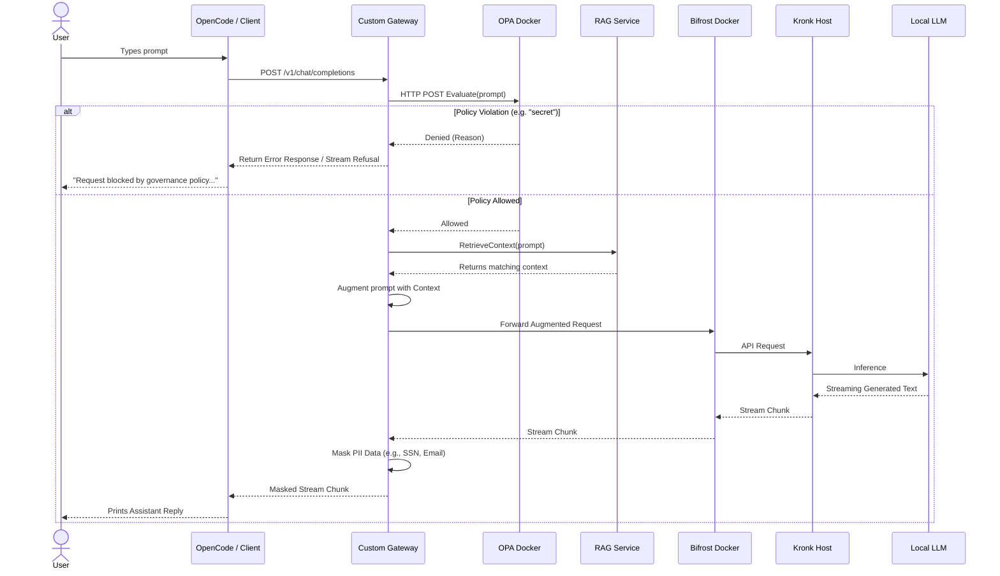

# Custom AI Proof of Concept

This repository is a Proof of Concept (POC) that integrates a custom AI router, local LLM gateway, governance policy engine, and dynamic context retrieval.

## Core Technologies
- **Custom AI Gateway**: A custom Go application that acts as the primary HTTP entry point, intercepting requests to perform governance, retrieve context, and mask PII.
- **[Bifrost](https://github.com/maximhq/bifrost)**: Acts as the core AI router and proxy, running as a standalone Docker container.
- **Kronk**: Local AI gateway connecting to underlying models (e.g., `Qwen3-0.6B-Q8_0`), running on the host machine.
- **Open Policy Agent (OPA)**: Runs as a standalone Docker service to evaluate Prompts and enforce governance (e.g., blocking sensitive keywords).
- **Retrieval-Augmented Generation (RAG)**: A custom retrieval service that fetches specialized knowledge to augment user prompts before they reach the LLM. It supports both PostgreSQL and In-Memory data stores.

## Architecture

The application intercepts the standard chat flow via a Custom HTTP Gateway. It first checks the user prompt against an OPA policy REST API. If allowed, it fetches additional context from the RAG service, injects it into the prompt, and forwards the augmented request to the Bifrost Gateway, which routes it to the local Kronk server. Streaming responses are intercepted by the Custom Gateway to apply dynamic PII masking before reaching the user.

```mermaid
flowchart TD
    User([User / OpenCode]) -->|HTTP Chat Prompt| Gateway[Custom AI Gateway (:8080)]
    
    subgraph Go Application
        Gateway --> OPAClient[OPA HTTP Client]
        Gateway --> RAG[RAG Interface]
        Gateway --> PIIMask[PII Masker]
    end
    
    subgraph Docker Containers
        OPAClient -->|REST Query| OPA[OPA Service (:8181)]
        Gateway -->|Augmented Prompt| Bifrost[Bifrost Gateway (:8081)]
    end
    
    RAG -.-> MemStore[In-Memory Store]
    RAG -.-> PGStore[Postgres Store]
    PGStore -->|SQL Query| PG[(PostgreSQL Docker)]
    
    OPA -->|Load Rules| PolicyDB[(policy/chat.rego)]
    
    Bifrost -->|Route to Model| Kronk[Local Kronk Gateway (:11435)]
    Kronk -->|Inference| Model((Local LLM))
    
    Kronk -.-> Bifrost
    Bifrost -.-> Gateway
    Gateway -.->|Stream PII Masking| User
```

## Request Sequence Flow

This sequence diagram illustrates the exact path a single chat message takes through the system.



## Getting Started

### Prerequisites
- Go 1.26+
- Docker and Docker Compose
- A local Kronk server running on `127.0.0.1:11435`
- OpenCode IDE

### OpenCode Configuration
Configure your `opencode.json` to point to the Custom AI Gateway:
```json
{
    "provider": {
        "custom-ai": {
            "npm": "@ai-sdk/openai-compatible",
            "name": "Custom AI (local)",
            "options": {
                "baseURL": "http://localhost:8080/v1"
            }
        }
    },
    "model": "custom-ai/Qwen3-0.6B-Q8_0"
}
```

### Running the Application

**Option 1: PostgreSQL Mode (Default)**
This will spin up local Docker containers for PostgreSQL, OPA, and Bifrost, automatically create the database schema, insert seed data, and start the background services.
```bash
make up
```
*To stop the containers later, run `make down`.*
Then start the Custom AI Gateway:
```bash
go run ./cmd/bifrost/main.go
```

**Option 2: In-Memory Mode**
If you don't want to run the Postgres database, you can start the application using the lightweight in-memory RAG implementation. (Note: OPA and Bifrost still run via Docker).
```bash
USE_IN_MEMORY=true go run ./cmd/bifrost/main.go
```

## Project Structure
- `cmd/bifrost/main.go`: The main entry point for the Custom HTTP Gateway.
- `cmd/bifrost/handlers/chat.go`: Handles HTTP routing, OPA evaluation, RAG injection, and streaming PII redaction.
- `pkg/governance/opa.go`: HTTP client for the OPA Docker container.
- `pkg/rag/`: The RAG `Retriever` interface and its memory/postgres implementations.
- `policy/chat.rego`: Rego v1 policies for chat governance.
- `schema/`: Initialization and seeding SQL scripts for PostgreSQL.
- `data/config.json`: Configurations for the standalone Bifrost Docker container.