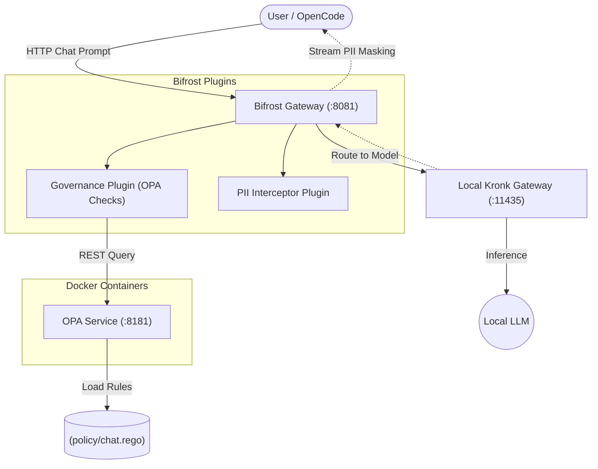
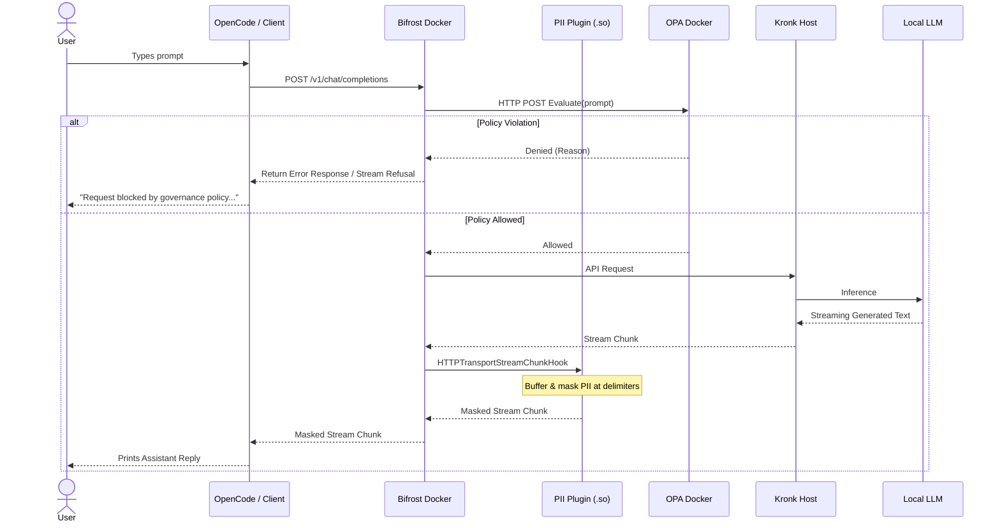

# Custom AI Proof of Concept

This repository is a Proof of Concept (POC) that integrates a custom AI router, local LLM gateway, and governance policy engine, leveraging native plugins for data security.

## Core Technologies
- **[Bifrost](https://github.com/maximhq/bifrost)**: Acts as the core AI router and proxy, running as a standalone Docker container on port `8081`. It serves as the primary entry point for AI IDEs like OpenCode.
- **PII Interceptor Plugin**: A native Go plugin running directly inside the Bifrost container that statefully intercepts streaming and non-streaming responses to mask sensitive data (SSN and Email formats) and provides OPA policy checks.
- **Kronk**: Local AI gateway connecting to underlying models (e.g., `Qwen3-0.6B-Q8_0`), running on the host machine.
- **Open Policy Agent (OPA)**: Runs as a standalone Docker service to evaluate Prompts and enforce governance (e.g., blocking sensitive keywords).

## Architecture

The IDE connects directly to the Bifrost Gateway. Requests are evaluated against OPA policies before being forwarded to the local Kronk server. Downstream responses are intercepted by the native PII Interceptor Plugin, which dynamically masks sensitive data.



## Request Sequence Flow

This sequence diagram illustrates the exact path a single chat message takes through the system.



## Getting Started

### Prerequisites
- Go 1.26+
- Docker and Docker Compose
- A local Kronk server running on `127.0.0.1:11435`
- OpenCode IDE

### OpenCode Configuration
Configure your `opencode.json` to point directly to Bifrost:
```json
{
    "provider": {
        "custom-ai": {
            "npm": "@ai-sdk/openai-compatible",
            "name": "Custom AI (local)",
            "options": {
                "baseURL": "http://localhost:8081/v1"
            },
            "models": {
                "custom-ai/Qwen3-0.6B-Q8_0": {
                    "name": "Qwen3-0.6B-Q8_0"
                }
            }
        }
    },
    "model": "custom-ai/Qwen3-0.6B-Q8_0"
}
```

### Running the Application

To spin up local Docker containers for OPA and Bifrost:
```bash
make up
```
*To stop the containers later, run `make down`.*

### Plugin Configuration

The PII Interceptor Plugin can be configured directly inside `data/config.json` by adding a `config` object to its registration. The supported parameters are:

- `opa_url` (string, optional): The HTTP URL for the Open Policy Agent service. Defaults to `http://opa:8181/v1/data/chat`.

Example registration:
```json
    {
      "enabled": true,
      "name": "pii-interceptor",
      "path": "/app/plugins/pii-interceptor.so",
      "version": 1,
      "config": {
        "opa_url": "http://opa:8181/v1/data/chat"
      }
    }
```

### Rebuilding the PII Plugin
If you make changes to the PII interceptor code, rebuild the Bifrost image and restart the containers:
```bash
make build-bifrost-image
make down
make up
```

## Project Structure
- `external/plugin/interception/main.go`: The complete source for the native Go PII masking plugin.
- `external/bifrost/`: Submodule representing Bifrost core.
- `data/config.json`: Configurations for the standalone Bifrost Docker container.
- `policy/chat.rego`: Rego v1 policies for OPA.