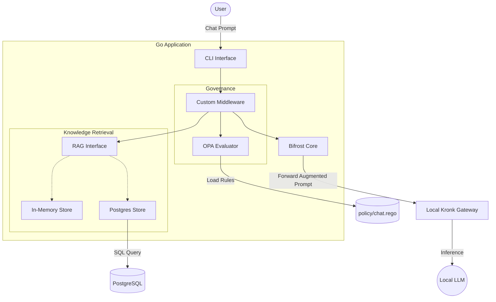
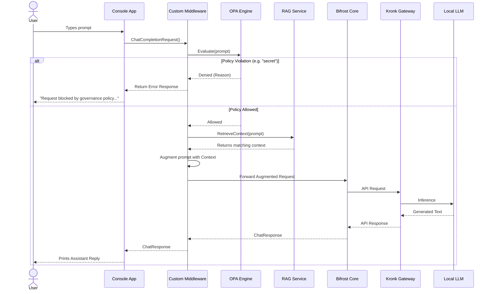

# Custom AI Proof of Concept

This repository is a Proof of Concept (POC) that integrates a custom AI router, local LLM gateway, governance policy engine, and dynamic context retrieval.

## Core Technologies
- **[Bifrost](https://github.com/maximhq/bifrost)**: Acts as the core AI router and proxy.
- **Kronk**: Local AI gateway connecting to underlying models (e.g., `Qwen3-0.6B-Q8_0`).
- **Open Policy Agent (OPA)**: Embedded directly in Go to evaluate Prompts and enforce governance (e.g., blocking sensitive keywords).
- **Retrieval-Augmented Generation (RAG)**: A custom retrieval service that fetches specialized knowledge to augment user prompts before they reach the LLM. It supports both PostgreSQL and In-Memory data stores.

## Architecture

The application intercepts the standard chat flow via a custom Middleware. It first checks the user prompt against an OPA policy. If allowed, it fetches additional context from the RAG service, injects it into the prompt, and forwards the augmented request to the Kronk LLM gateway.



## Request Sequence Flow

This sequence diagram illustrates the exact path a single chat message takes through the system.



## Getting Started

### Prerequisites
- Go 1.26+
- Docker and Docker Compose
- A local Kronk server running on `127.0.0.1:11435`

### Running the Application

**Option 1: PostgreSQL Mode (Default)**
This will spin up a local PostgreSQL 15 container, automatically create the database schema, insert seed data, and start the Go application.
```bash
make up
```
*To stop the database later, run `make down`.*

**Option 2: In-Memory Mode (No Docker required)**
If you don't want to run the database, you can start the application using the lightweight in-memory RAG implementation.
```bash
USE_IN_MEMORY=true make run
```

## Project Structure
- `cmd/bifrost/main.go`: The main entry point.
- `pkg/plugin/middleware.go`: The custom Bifrost interceptor handling OPA and RAG logic.
- `pkg/governance/opa.go`: The embedded OPA v1 engine.
- `pkg/rag/`: The RAG `Retriever` interface and its memory/postgres implementations.
- `policy/chat.rego`: Rego v1 policies for chat governance.
- `schema/`: Initialization and seeding SQL scripts for PostgreSQL.


## Last run logs
```
❯ make up
docker-compose up -d
WARN[0000] No services to build
[+] up 1/1
 ✔ Container custom-ai-postgres Running                                                                        0.0s
go run ./cmd/bifrost/main.go
{"level":"warn","time":"2026-05-19T16:16:39-03:00","message":"insecure_skip_verify is enabled for provider — TLS certificate verification is disabled. Not recommended for production."}
Using Postgres RAG store
Chat started. Type 'exit' to quit.

You: what is kronk?

[Middleware] Injecting RAG Context as System Message: Additional Context:
- Kronk is an AI gateway or model server that acts as a bridge to underlying local models.

Assistant:

Kronk is an AI gateway or model server that acts as a bridge between underlying local models and external systems. It enables seamless integration, communication, and interaction between different AI models or systems, facilitating tasks such as language processing, data analysis, or other AI-driven applications.

You: exit
{"level":"info","time":"2026-05-19T16:16:55-03:00","message":"closing all request channels..."}
{"level":"info","time":"2026-05-19T16:16:55-03:00","message":"all request channels closed"}
```